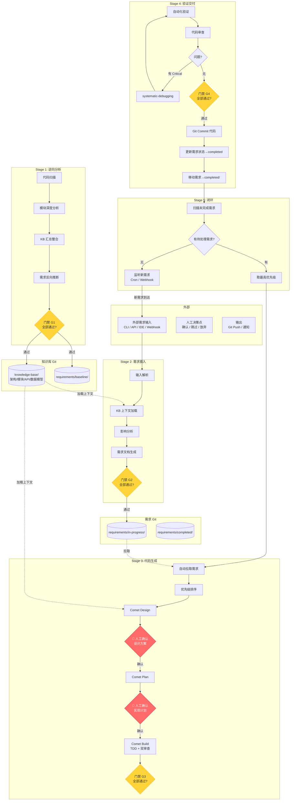
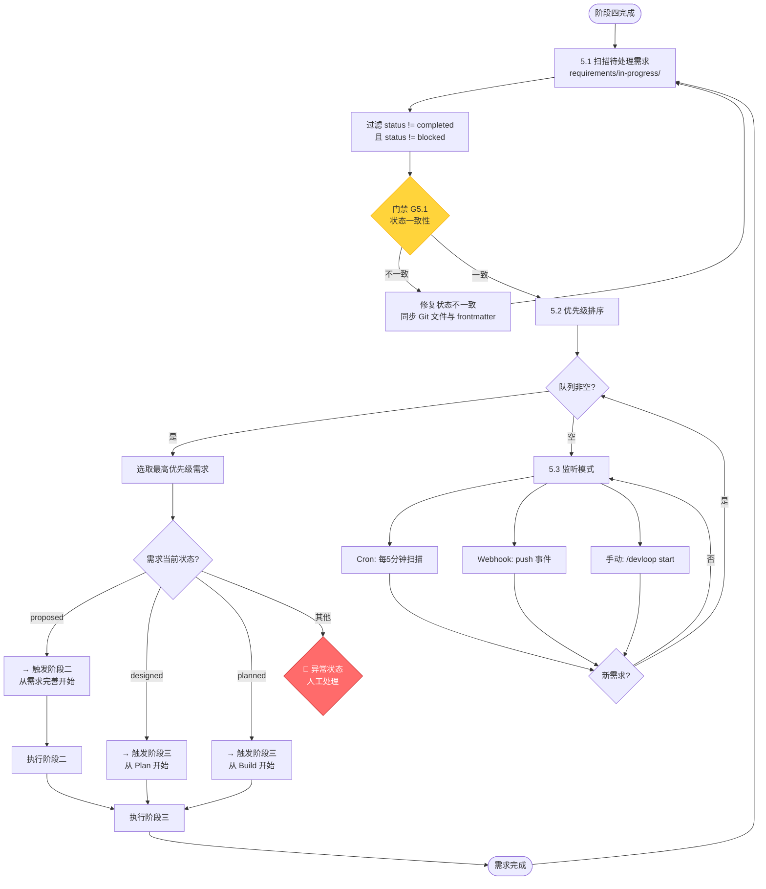
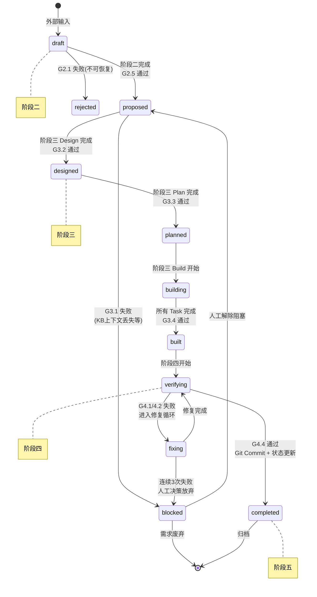
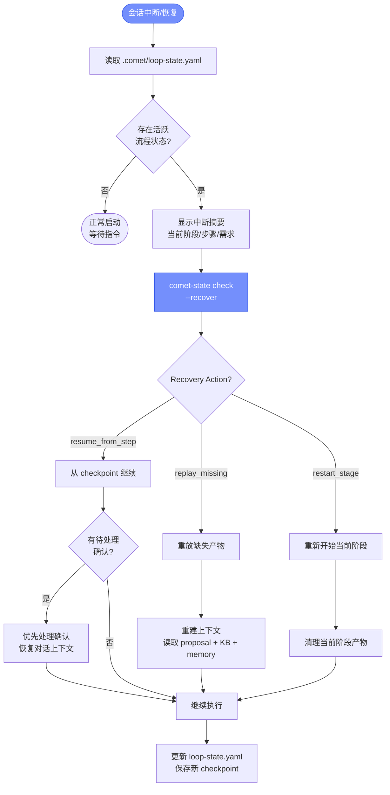
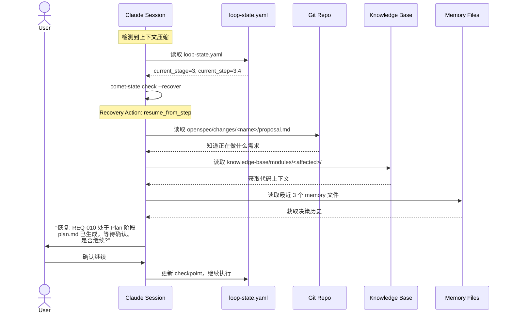
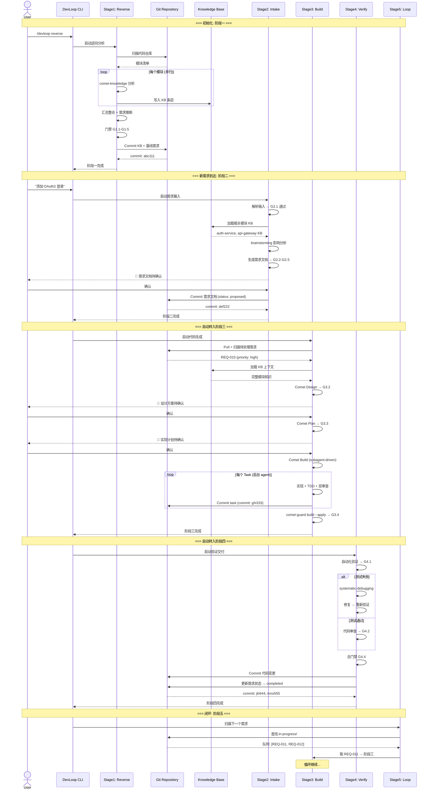
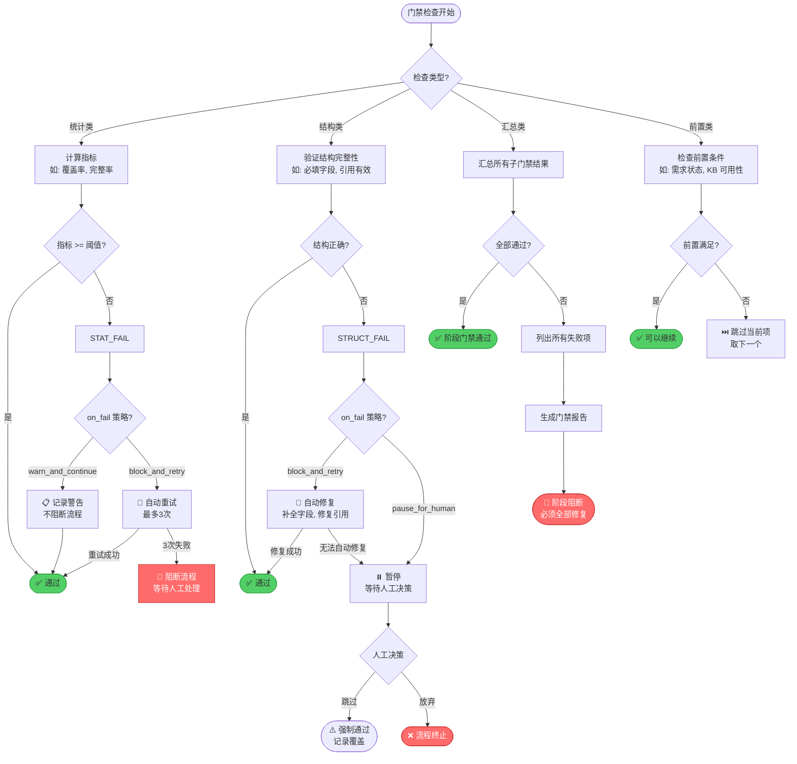

# 03 — 流程图 (Mermaid Flowcharts)

## 目录

1. [系统全景图](#1-系统全景图)
2. [阶段一：逆向分析](#2-阶段一逆向分析)
3. [阶段二：需求摄入](#3-阶段二需求摄入)
4. [阶段三：代码生成](#4-阶段三代码生成)
5. [阶段四：验证交付](#5-阶段四验证交付)
6. [阶段五：闭环回写](#6-阶段五闭环回写)
7. [需求状态机](#7-需求状态机)
8. [中断恢复流程](#8-中断恢复流程)
9. [完整序列图](#9-完整序列图)
10. [门禁决策树](#10-门禁决策树)

---

## 1. 系统全景图



---

## 2. 阶段一：逆向分析

```mermaid
flowchart TD
    START([开始: 阶段一触发]) --> CHECK{知识库是否<br/>已存在?}
    
    CHECK -->|首次运行| FULL[全量逆向]
    CHECK -->|已存在| DELTA[增量逆向<br/>只分析变更部分]
    
    FULL --> SCAN[1.1 代码扫描<br/>codegraph_explore]
    DELTA --> DIFF[Git diff 获取变更文件]
    DIFF --> SCAN
    
    SCAN --> MANIFEST[生成模块清单<br/>knowledge-base/.manifest.yaml]
    MANIFEST --> G1_1{门禁 G1.1<br/>模块覆盖率 >= 80%?}
    G1_1 -->|否| ADD_MOD[补充手动指定模块]
    ADD_MOD --> SCAN
    G1_1 -->|是| PARALLEL[1.2 并行模块分析]
    
    PARALLEL --> M1[comet-knowledge<br/>模块 A]
    PARALLEL --> M2[comet-knowledge<br/>模块 B]
    PARALLEL --> M3[comet-knowledge<br/>模块 N...]
    
    M1 --> COLLECT[收集 KB 条目]
    M2 --> COLLECT
    M3 --> COLLECT
    
    COLLECT --> G1_2{门禁 G1.2<br/>KB 条目完整?}
    G1_2 -->|否| RETRY[重试缺失模块<br/>最多3次]
    RETRY --> PARALLEL
    G1_2 -->|是| INTEGRATE[1.3 KB 汇总整合]
    
    INTEGRATE --> ARCH[生成 architecture/]
    INTEGRATE --> APIS[生成 apis/]
    INTEGRATE --> MODELS[生成 data-models/]
    
    ARCH --> G1_3{门禁 G1.3<br/>内部引用一致?}
    APIS --> G1_3
    MODELS --> G1_3
    
    G1_3 -->|否| FIX_REF[修复引用]
    FIX_REF --> INTEGRATE
    G1_3 -->|是| INFER[1.4 需求反向推断<br/>brainstorming]
    
    INFER --> REQ_DOCS[生成基线需求文档<br/>requirements/baseline/]
    REQ_DOCS --> G1_4{门禁 G1.4<br/>需求覆盖率 >= 90%?}
    G1_4 -->|否| LOW_CONF[标记低置信度需求]
    LOW_CONF --> G1_5
    G1_4 -->|是| G1_5{门禁 G1.5<br/>阶段一总门禁}
    
    G1_5 -->|通过| COMMIT1[Git Commit<br/>[devloop] stage:1]
    COMMIT1 --> DONE1([阶段一完成])
    G1_5 -->|失败| REPORT1[生成失败报告]
    REPORT1 --> PAUSE1([暂停: 等待人工处理])
    
    style G1_1 fill:#ffd43b,stroke:#fab005
    style G1_2 fill:#ffd43b,stroke:#fab005
    style G1_3 fill:#ffd43b,stroke:#fab005
    style G1_4 fill:#ffd43b,stroke:#fab005
    style G1_5 fill:#ff6b6b,stroke:#c92a2a,color:#fff
```

---

## 3. 阶段二：需求摄入

```mermaid
flowchart TD
    START([开始: 需求输入到达]) --> PARSE[2.1 输入解析]
    
    PARSE --> FORMAT{输入格式?}
    FORMAT -->|自然语言| NL[解析自然语言]
    FORMAT -->|用户故事模板| US[解析用户故事]
    FORMAT -->|Bug 报告| BUG[解析 Bug 报告]
    FORMAT -->|技术规格| SPEC[解析技术规格]
    
    NL --> G2_1
    US --> G2_1
    BUG --> G2_1
    SPEC --> G2_1
    
    G2_1{门禁 G2.1<br/>输入有效性}
    G2_1 -->|无效| REJECT[拒绝: 返回错误信息]
    REJECT --> START
    G2_1 -->|有效| LOAD_KB[2.2 KB 上下文加载]
    
    LOAD_KB --> MATCH[关键词匹配<br/>需求描述 → KB 模块]
    MATCH --> LOAD[加载匹配模块的 KB 条目<br/>+ 全局 architecture/apis/]
    
    LOAD --> G2_2{门禁 G2.2<br/>至少匹配 1 个<br/>相关模块?}
    G2_2 -->|否| MARK_LOW[标记 confidence: low<br/>可能为新模块]
    MARK_LOW --> IMPACT
    G2_2 -->|是| IMPACT[2.3 影响分析<br/>brainstorming]
    
    IMPACT --> IA_DOC[生成影响分析报告<br/>涉及模块/数据模型变更/API变更/风险]
    IA_DOC --> G2_3{门禁 G2.3<br/>影响分析完整?}
    G2_3 -->|否| COMPLETE_IA[补充分析]
    COMPLETE_IA --> IMPACT
    G2_3 -->|是| GEN_REQ[2.4 需求文档生成]
    
    GEN_REQ --> OPENSEC[comet-open<br/>创建 OpenSpec Change]
    OPENSEC --> REQ_DOC[生成统一需求文档<br/>requirements/in-progress/]
    
    REQ_DOC --> G2_4{门禁 G2.4<br/>需求文档结构正确?}
    G2_4 -->|否| FIX_REQ[修复文档]
    FIX_REQ --> GEN_REQ
    G2_4 -->|是| G2_5{门禁 G2.5<br/>阶段二总门禁}
    
    G2_5 -->|通过| HUMAN_CONFIRM{🔴 人工确认<br/>需求内容}
    HUMAN_CONFIRM -->|确认| COMMIT2[Git Commit<br/>[devloop] stage:2<br/>status: proposed]
    HUMAN_CONFIRM -->|修改| FEEDBACK[收集修改意见]
    FEEDBACK --> IMPACT
    COMMIT2 --> DONE2([阶段二完成<br/>→ 进入阶段三])
    
    G2_5 -->|失败| REPORT2[生成失败报告]
    REPORT2 --> PAUSE2([暂停: 等待人工处理])
    
    style G2_1 fill:#ffd43b,stroke:#fab005
    style G2_2 fill:#ffd43b,stroke:#fab005
    style G2_3 fill:#ffd43b,stroke:#fab005
    style G2_4 fill:#ffd43b,stroke:#fab005
    style G2_5 fill:#ff6b6b,stroke:#c92a2a,color:#fff
    style HUMAN_CONFIRM fill:#ff6b6b,stroke:#c92a2a,color:#fff
```

---

## 4. 阶段三：代码生成

```mermaid
flowchart TD
    START([开始: 阶段三触发]) --> PULL[3.1 Git Pull<br/>同步远程]
    PULL --> SCAN[扫描 requirements/in-progress/<br/>status != completed, blocked]
    
    SCAN --> G3_1{门禁 G3.1<br/>需求可构建?}
    G3_1 -->|否| BLOCK[标记为 blocked<br/>记录原因]
    BLOCK --> SKIP[跳过, 取下一个需求]
    SKIP --> SCAN
    G3_1 -->|是| SORT[3.2 优先级排序]
    
    SORT --> SELECT[选取最高分需求]
    SELECT --> LOAD_CTX[加载需求文档 + KB 上下文]
    
    LOAD_CTX --> DESIGN[3.3 Comet Design]
    DESIGN --> DESIGN_STEPS[comet-handoff → brainstorming → design.md]
    DESIGN_STEPS --> DESIGN_GUARD[comet-guard design --apply]
    
    DESIGN_GUARD --> G3_2{门禁 G3.2<br/>ALL CHECKS PASSED?}
    G3_2 -->|否| FIX_DESIGN[修复设计]
    FIX_DESIGN --> DESIGN
    G3_2 -->|是| HUMAN3{🔴 人工确认<br/>设计方案}
    
    HUMAN3 -->|修改| DESIGN
    HUMAN3 -->|确认| PLAN[3.4 Comet Plan<br/>writing-plans]
    
    PLAN --> PLAN_DOC[生成 plan.md + tasks.md]
    PLAN_DOC --> G3_3{门禁 G3.3<br/>Plan 质量}
    G3_3 -->|否| FIX_PLAN[修复计划]
    FIX_PLAN --> PLAN
    G3_3 -->|是| HUMAN4{🔴 人工确认<br/>实现计划}
    
    HUMAN4 -->|暂停| SAVE_STATE[保存状态<br/>等待恢复]
    HUMAN4 -->|确认| CHOOSE_MODE{选择 Build 模式}
    
    CHOOSE_MODE -->|小需求<br/>< 5 tasks| MODE_A[executing-plans<br/>主会话执行]
    CHOOSE_MODE -->|中大型需求| MODE_B[subagent-driven-development<br/>后台子代理]
    
    MODE_A --> BUILD_LOOP
    MODE_B --> BUILD_LOOP
    
    subgraph BUILD_LOOP["3.5 Build Loop (每个 Task)"]
        TASK_START[取下一个未完成 task] --> IMPL[实现 Task]
        IMPL --> TDD[TDD 验证<br/>test-driven-development]
        TDD --> TDD_PASS{测试通过?}
        TDD_PASS -->|否| FIX_IMPL[修复实现<br/>最多3轮]
        FIX_IMPL --> IMPL
        TDD_PASS -->|是| REVIEW1[Spec Compliance Review]
        REVIEW1 --> REVIEW2[Code Quality Review]
        REVIEW2 --> BOTH_PASS{双审查通过?}
        BOTH_PASS -->|否| FIX_REVIEW[修复审查问题]
        FIX_REVIEW --> IMPL
        BOTH_PASS -->|是| TASK_COMMIT[Git Commit task]
        TASK_COMMIT --> TASK_DONE{还有 task?}
        TASK_DONE -->|是| TASK_START
        TASK_DONE -->|否| BUILD_DONE[所有 task 完成]
    end
    
    BUILD_DONE --> BUILD_GUARD[comet-guard build --apply]
    BUILD_GUARD --> G3_4{门禁 G3.4<br/>ALL CHECKS PASSED?}
    G3_4 -->|否| FIX_BUILD[修复]
    FIX_BUILD --> BUILD_LOOP
    G3_4 -->|是| DONE3([阶段三完成<br/>→ 进入阶段四])
    
    style G3_1 fill:#ffd43b,stroke:#fab005
    style G3_2 fill:#ffd43b,stroke:#fab005
    style G3_3 fill:#ffd43b,stroke:#fab005
    style G3_4 fill:#ff6b6b,stroke:#c92a2a,color:#fff
    style HUMAN3 fill:#ff6b6b,stroke:#c92a2a,color:#fff
    style HUMAN4 fill:#ff6b6b,stroke:#c92a2a,color:#fff
```



---

## 5. 阶段四：验证交付

```mermaid
flowchart TD
    START([开始: 阶段四触发]) --> VERIFY[4.1 自动化验证<br/>comet-verify]
    
    VERIFY --> SCALE[comet-state scale<br/>确定验证级别]
    SCALE --> RUN_TESTS[运行测试套件<br/>+ 构建 + Lint + 类型检查]
    
    RUN_TESTS --> G4_1{门禁 G4.1<br/>全部通过?}
    G4_1 -->|失败| COUNT{失败次数?}
    COUNT -->|< 3| DEBUG[4.3 systematic-debugging<br/>定位根因]
    DEBUG --> FIX[生成修复]
    FIX --> RUN_TESTS
    COUNT -->|>= 3| HUMAN_FAIL{🔴 连续3次失败<br/>人工决策}
    HUMAN_FAIL -->|继续修复| DEBUG
    HUMAN_FAIL -->|接受偏差| ACCEPT[记录偏差<br/>标记 known-issue]
    HUMAN_FAIL -->|放弃| ABORT[标记需求 blocked<br/>回滚变更]
    
    G4_1 -->|通过| REVIEW[4.2 代码审查<br/>code-review]
    ACCEPT --> REVIEW
    
    REVIEW --> G4_2{门禁 G4.2<br/>无 Critical 问题?}
    G4_2 -->|有 Critical| FIX_CRIT[修复 Critical 问题]
    FIX_CRIT --> RUN_TESTS
    G4_2 -->|通过| FINAL_CHECK[4.4 最终门禁]
    
    FINAL_CHECK --> G4_4{门禁 G4.4<br/>阶段四总门禁}
    G4_4 -->|失败| REPORT4[生成失败报告]
    REPORT4 --> PAUSE4([暂停: 等待人工处理])
    
    G4_4 -->|通过| COMMIT_CODE[4.5 Git Commit 代码<br/>[devloop] stage:4]
    COMMIT_CODE --> UPDATE_STATUS[4.6 更新需求状态<br/>status: verifying → completed]
    UPDATE_STATUS --> MOVE_REQ[移动需求文档<br/>in-progress/ → completed/]
    MOVE_REQ --> COMMIT_REQ[Git Commit 需求状态<br/>[devloop] stage:5]
    COMMIT_REQ --> DONE4([阶段四完成<br/>→ 进入阶段五])
    
    style G4_1 fill:#ffd43b,stroke:#fab005
    style G4_2 fill:#ffd43b,stroke:#fab005
    style G4_4 fill:#ff6b6b,stroke:#c92a2a,color:#fff
    style HUMAN_FAIL fill:#ff6b6b,stroke:#c92a2a,color:#fff
```

---

## 6. 阶段五：闭环回写



---

## 7. 需求状态机



---

## 8. 中断恢复流程



### 上下文压缩恢复序列



---

## 9. 完整序列图



---

## 10. 门禁决策树


